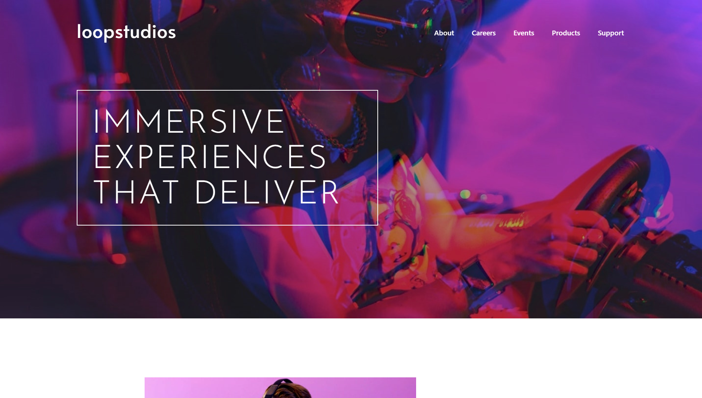

# Frontend Mentor - Loopstudios landing page

This is my solution to the [Loopstudios landing page challenge](https://www.frontendmentor.io/) on Frontend Mentor. Frontend Mentor challenges help you improve your coding skills by building realistic projects.

## Table of contents

- [Overview](#overview)
  - [Screenshot](#screenshot)
  - [Links](#links)
  - [Built with](#built-with)
- [Author](#author)

### Screenshot

### Links

- Live Site URL: [Live Site]()

### Built with

- React
- Tailwind
- Typescript
- FramerMotion
- Mobile first design

## Author

- Github - [@DundeeA](https://github.com/DundeeA)
